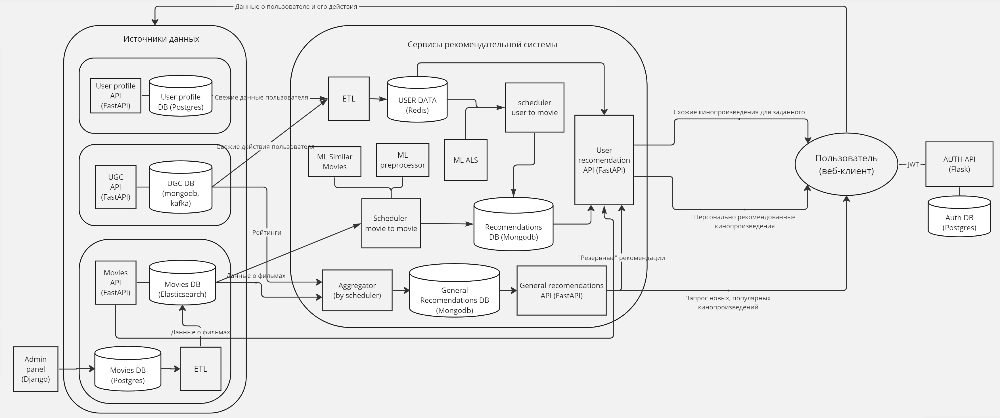

# Проектная работа: диплом
---

https://github.com/krvlr/graduate_work

**Идея**:

Пользователю онлайн-кинотеатра рекомендовать непросмотренные кинопроизведения.  

**Цели**:

- Повысить доходы кинотеатра за счет посещаемости и просмотров фильмов на сайте. 
- Повысить лояльность пользователей.

**Функциональные требования**:

- Рекомендовать фильмы исходя из указанных пользователем предпочтений - жанров и интересов.
- Рекомендовать популярные фильмы, часто просматриваемые, с хорошей оценкой/отзывами, новые. 
- `Item/content-based` рекомендации. Рекомендовать фильмы близкие для просмотренных. 
- `User-based` рекомендации. Рекомендовать фильмы, которые могут понравиться исходя из истории реакций и просмотров пользователя, а также опираясь на данные "близких" пользователей. В случае отсутствия действий пользователя (холодный старт), выводить рекомендации из п. 1-2.

**Нефункциональные требования**:  

**Надежность**:
* `SLI (service level indicator)`: время безотказной работы сервиса 99,9%.
* `SLO (service level objective)`: задержка выполнения запроса, подбор рекомендаций не больше 200 мс.
* В случае отказа части системы, необходимо обеспечить мягкую деградацию: если не доступны 3 или 4 типы рекомендаций, применять 1 и 2 типы.

**Масштабирование**: сервис должен работать асинхронно и быть легко масштабируемым, с возможностью развертывания на множестве узлов.  
**Безопасность**: не должно быть уязвимостей по утечке персональных данных пользователей.

