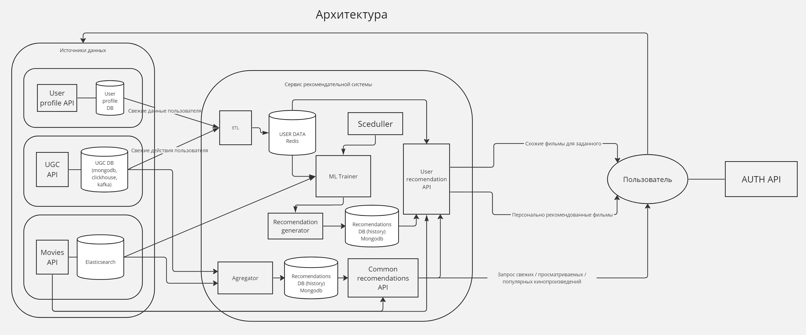

# Проектная работа: диплом

https://github.com/krvlr/graduate_work

Идея:
Пользователю онлайн кинотеатра рекомендовать не просмотренные кинопроизведения.  
Зачем?
Позволит повысить посещаемость и просмотры фильмов, а следственно, доходы. Повысить лояльность пользователей.

Функциональные требования:
1. Рекомендовать фильмы исходя из указанных пользователем предпочтений - жанров и интересов.
1. Рекомендовать популярные фильмы, часто просматриваемые, с хорошей оценкой/отзывами, новые.
1. Item/content-based рекомендации. Рекомендовать фильмы близкие для просмотренных.
1. User-based рекомендации. Рекомендовать фильмы, которые могут понравиться исходя из истории просмотров пользователя, оценок исходя из данных других пользователей "близких" к данному. В случае отсутствия действий пользователя (холодный старт), выводить рекомендации из п. 1-2.
1. Предлагать недосмотренные фильмы.

Нефункциональные требования:  
Надежность:
* SLI (service level indicator): время безотказной работы сервиса 99,9%.
* SLO (service level objective): задержка выполнения запроса подбор рекомендаций должна быть больше 200 мс.
* В случае отказа части системы реализовать мягкую деградацию: если не доступны 3 или 4 типы рекомендаций, применять 1 и 2 типы.

Масштабирование: сервис должен работать асинхронно и быть легко масштабируемым, с возможностью развертывания на множестве узлов.  
Безопасность: не должно быть уязвимостей по утечке персональных данных пользователей.

 # TODO обновить (возможно перенести в PlantUML)